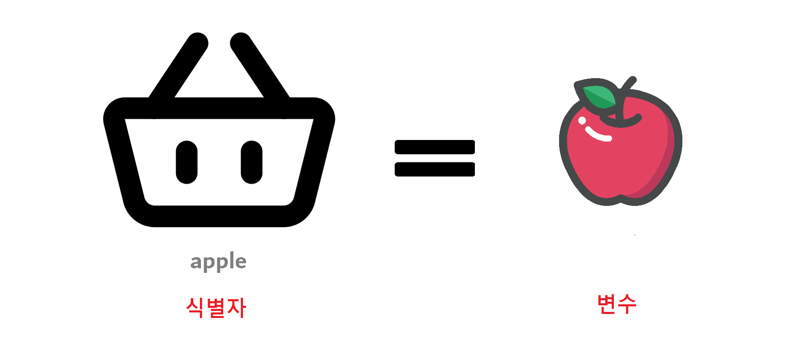

---
layout:
  title:
    visible: true
  description:
    visible: false
  tableOfContents:
    visible: true
  outline:
    visible: true
  pagination:
    visible: true
---

# 1) Data types

### 데이터 타입의 종류

<table><thead><tr><th width="135">타입</th><th width="376">종류</th><th>특징</th></tr></thead><tbody><tr><td><strong>기본형</strong>(primitive)</td><td>number, string, boolean, null, undefined, Symbol</td><td>불변성(immutability)</td></tr><tr><td><strong>참조형</strong>(reference)</td><td><mark style="background-color:yellow;">Object</mark>(Array, Function, Date, RegExp, Map, WeakMap, Set, WeakSet)</td><td>가변성(variability)</td></tr></tbody></table>

### 식별자와 변수

<div align="left">

<figure><figcaption><p>→ 식별자는 'apple'이고 '사과'라는 변수를 담는다.</p></figcaption></figure>

</div>

* **변수(variable)** : 변할 수 있는 무언가.
* **식별자(identifier)** : 어떤 데이터를 식별하는 데 사용하는 이름, <mark style="background-color:yellow;">변수명</mark>.

### 데이터 할당

> 데이터 영역의 주소 값을 변수 영역에서 사용하지 않고 있다면, _<mark style="color:orange;">가비지 컬렉터(garbage collector)</mark>_의 수거 대상이 된다.

```javascript
let apple; // 변수 선언
apple = '🍎'; // 데이터 할당
```

<div align="left">

<figure><figcaption><p>→ 자유로운 데이터 변환과 효율적인 메모리 관리를 위해 변수영역과 데이터영역으로 분리.</p></figcaption></figure>

</div>

