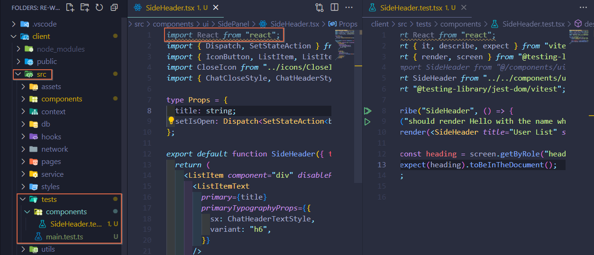
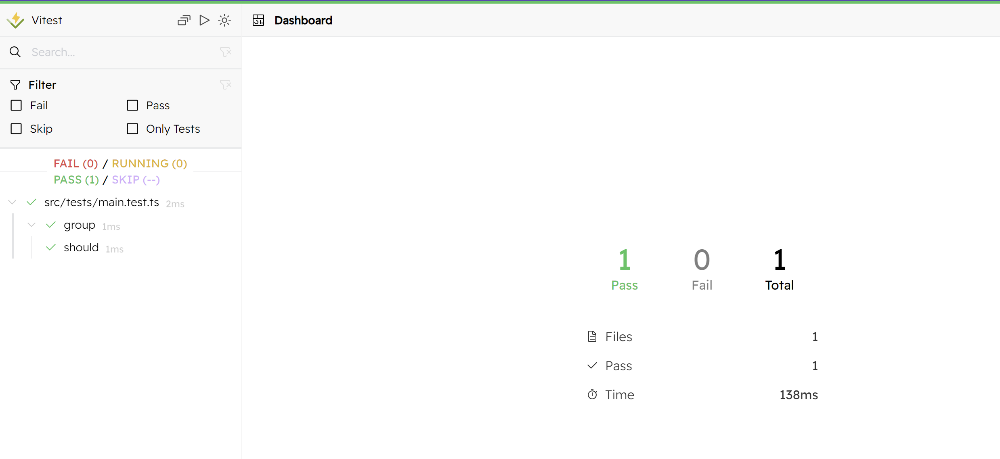

# 1. Setup

## 1. [vitest](https://vitest.dev/guide/) Library 설치

```bash
$ npm i -D vitest
```

```json
// package.json

{
 "scripts": {
    ...,
    "test": "vitest",
    "test:ui": "vitest --ui"
  },
}
```

```javascript
// vitest.config.ts

import { defineConfig } from "vitest/config";
import path from "path";

export default defineConfig({
  test: {
    environment: "jsdom",
  },
  resolve: {
    alias: {
      "@": path.resolve(__dirname, "./src"),
    },
  },
});
```


## 2. Extension 설치

* `Vitest`
* `Vitest Snippets` : 빠른 코드 조각 가져오는 기능

```javascript
// iv 입력 후 엔터
import { it, expect, describe } from 'vitest';

// d 입력 후 엔터
describe('group', () => { });

// i 입력 후 엔터
it('should', () => { });
```


## 3. [React Testing](https://testing-library.com/docs/react-testing-library/intro/) Library 설치

```bash
$ npm i -D @testing-library/react@14.2.0 @testing-library/jest-dom
$ npm i -D jsdom@24.0.0
```


## 4. test code 작성

<figure><figcaption></figcaption></figure>


## 5. vitest ui 실행 테스트

```bash
$ npm run test:ui

> client@0.0.0 test:ui
> vitest --ui

 MISSING DEPENDENCY  Cannot find dependency '@vitest/ui'

√ Do you want to install @vitest/ui? ... yes
```

<figure><figcaption></figcaption></figure>
