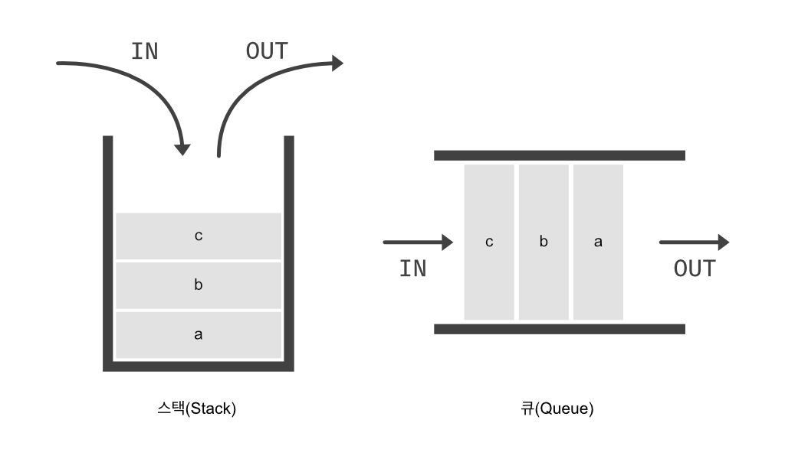

---
layout:
  title:
    visible: true
  description:
    visible: false
  tableOfContents:
    visible: true
  outline:
    visible: true
  pagination:
    visible: true
---

# 3) Stack & Queue

<figure><figcaption>
Stack &#x26; Queue 메모리 구조
</figcaption></figure>

<table><thead><tr><th width="161">Data Structure</th><th width="230">Structure</th><th>Main operations</th></tr></thead><tbody><tr><td>스택(Stack)</td><td>후입선출(<mark style="color:orange;">L</mark>ast <mark style="color:orange;">I</mark>n, <mark style="color:orange;">F</mark>irst <mark style="color:orange;">O</mark>ut, <strong>LIFO</strong>)</td><td>

<ol><li><strong>Push</strong>: 데이터를 스택에 추가.</li><li><strong>Pop</strong>: 스택에서 가장 위에 있는 데이터를 제거하고 반환.</li><li><strong>Peek/Top</strong>: 스택의 가장 위에 있는 데이터를 반환하지만, 제거❌</li></ol></td></tr><tr><td>큐Queue)</td><td>선입선출(<mark style="color:orange;">F</mark>irst <mark style="color:orange;">I</mark>n, <mark style="color:orange;">F</mark>irst <mark style="color:orange;">O</mark>ut, <strong>FIFO</strong>)</td><td>

<ol><li><strong>Enqueue</strong>: 데이터를 큐의 끝에 추가.</li><li><strong>Dequeue</strong>: 큐의 시작 부분에서 데이터를 제거하고 반환.</li><li><strong>Front</strong>: 큐의 맨 앞에 있는 데이터를 반환하지만, 제거❌</li></ol></td></tr></tbody></table>

### 사용 예


[3-1-stack.md](3-1-stack.md)



[3-2-queue.md](3-2-queue.md)

