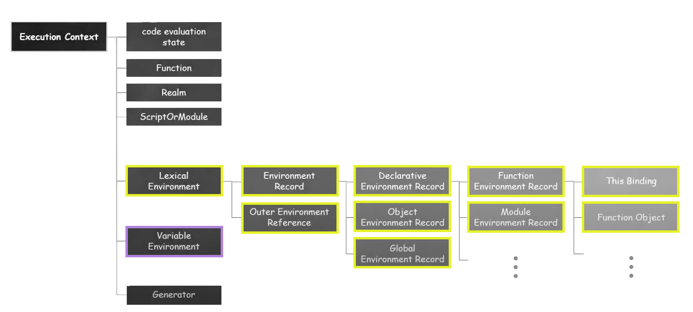

---
layout:
  title:
    visible: true
  description:
    visible: false
  tableOfContents:
    visible: true
  outline:
    visible: true
  pagination:
    visible: true
---

# 02. Execution Context

* 실행 컨텍스트는 **실행할 코드에 제공할 **<mark style="background-color:orange;">**환경 정보**</mark>들을 모아 놓은 객체.
* 활성화되는 시점에 **`VariableEnvironment`**, **`LexicalEnvironment`**, **`ThisBinding`**의 세 가지 정보를 수집.

<figure><figcaption>
실행 컨텍스트 구성
</figcaption></figure>


[1-stack-and-queue](1-stack-and-queue/)



[2-ve-and-le](2-ve-and-le/)


#### 참고

[\[10분 테코톡\] 💙하루의 실행 컨텍스트](https://www.youtube.com/watch?v=EWfujNzSUmw)
