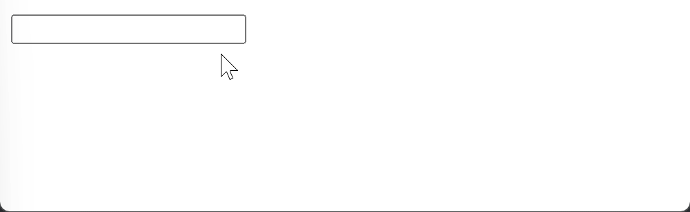

---
layout:
  title:
    visible: true
  description:
    visible: false
  tableOfContents:
    visible: true
  outline:
    visible: true
  pagination:
    visible: true
---

# 1-1) 디바운스

* **디바운스(debounce)**는 짧은 시간 간격으로 이벤트가 연속해서 발생하면 이벤트 핸들러를 호출하지 않다가 <mark style="background-color:orange;">일정시간이 경과한 이후에 이벤트 핸들러가 한 번만 호출되도록 한다</mark>.
* resize 이벤트 처리, input 요소에 입력된 값으로 ajax 요청하는 입력 필드 자동완성 UI 구현, 버튼 중복 클릭 방지 처리 등에 유용하게 사용된다.
* 실무에서는 Underscore의 debounce 함수나 Lodash의 debounce 함수를 사용하는 것을 권장한다.

<figure><figcaption><p>-> 연속적인 이벤트 호출이 끝나면 delay 시간 후 함수 수행.</p></figcaption></figure>

```html
<!DOCTYPE html>
<html>
<body>
  <input type="text">
  <div class="msg"></div>
  <script>
    const $input = document.querySelector('input');
    const $msg = document.querySelector('.msg');

    const debounce = (callback, delay) => {
      let timerId;
      // debounce 함수는 timerId를 기억하는 클로저를 반환한다.
      return (...args) => {
        // delay가 경과하기 이전에 이벤트가 발생하면 이전 타이머를 취소하고
        // 새로운 타이머를 재설정한다.
        // 따라서 delay보다 짧은 간격으로 이벤트가 발생하면 callback은 호출되지 않는다.
        if (timerId) clearTimeout(timerId);
        timerId = setTimeout(callback, delay, ...args);
      };
    };

    // debounce 함수가 반환하는 클로저가 이벤트 핸들러로 등록된다.
    // 1000ms보다 짧은 간격으로 input 이벤트가 발생하면 debounce 함수의 콜백 함수는
    // 호출되지 않다가 1000ms 동안 input 이벤트가 더 이상 발생하면 한 번만 호출된다.
    $input.oninput = debounce(e => {
      $msg.textContent = e.target.value;
    }, 1000);
  </script>
</body>
</html>
```

<div align="left">

<figure><figcaption><p>→ 1초 후 <code>안녕하세요:)</code> 출력.</p></figcaption></figure>

</div>

