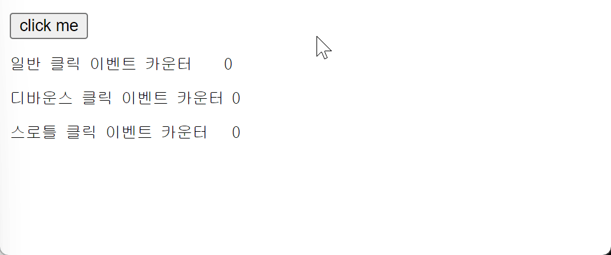

---
layout:
  title:
    visible: true
  description:
    visible: false
  tableOfContents:
    visible: true
  outline:
    visible: true
  pagination:
    visible: true
---

# 1) 디바운스와 스로틀

* scroll, resize, input, mousemove 같은 이벤트에 바인딩한 이벤트 핸들러는 짧은 시간 간격으로 연속해서  과도 하게 호출되어 성능에 문제를 일으킬 수 있다.
* **디바운스와 스로틀은** 짧은 시간 간격으로 연속해서 발생하는 <mark style="background-color:orange;">이벤트를 그룹화해서 과도한 이벤트 핸들러의 호출을 방지하는 프로그래밍 기법</mark>이다.

```html
<!DOCTYPE html>
<html>
  <body>
    <button>click me</button>
    <pre>일반 클릭 이벤트 카운터    <span class="normal-msg">0</span></pre>
    <pre>디바운스 클릭 이벤트 카운터 <span class="debounce-msg">0</span></pre>
    <pre>스로틀 클릭 이벤트 카운터   <span class="throttle-msg">0</span></pre>
    <script>
      const $button = document.querySelector("button");
      const $normalMsg = document.querySelector(".normal-msg");
      const $debounceMsg = document.querySelector(".debounce-msg");
      const $throttleMsg = document.querySelector(".throttle-msg");

      const debounce = (callback, delay) => {
        let timerId;
        return (...args) => {
          if (timerId) clearTimeout(timerId);
          timerId = setTimeout(callback, delay, ...args);
        };
      };

      const throttle = (callback, delay) => {
        let timerId;
        return (...args) => {
          if (timerId) return;
          timerId = setTimeout(() => {
            callback(...args);
            timerId = null;
          }, delay);
        };
      };

      $button.addEventListener("click", () => {
        $normalMsg.textContent = +$normalMsg.textContent + 1;
      });

      $button.addEventListener(
        "click",
        debounce(() => {
          $debounceMsg.textContent = +$debounceMsg.textContent + 1;
        }, 500)
      );

      $button.addEventListener(
        "click",
        throttle(() => {
          $throttleMsg.textContent = +$throttleMsg.textContent + 1;
        }, 500)
      );
    </script>
  </body>
</html>
```

<div align="left">

<figure><figcaption><p>→ 일반적인 이벤트 핸들러와 디바운스, 스로틀된 이벤트 핸들러의 호출 빈도 확인.</p></figcaption></figure>

</div>

